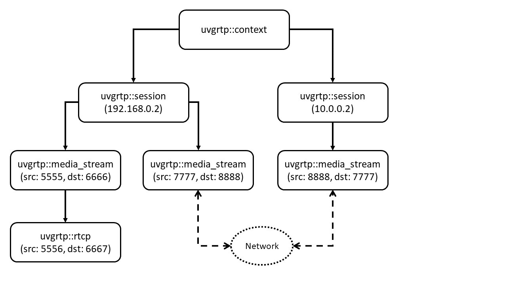

# Documentation for uvgRTP

This file provides documentation of uvgRTP's usage and public API. The focus in this tutorial focuses on in-depth scenarios of uvgRTP usage. If you want to learn the basic usage of uvgRTP, see the [examples](/examples) folder.

## The public API



The top-level object for uvgRTP is the `uvgrtp::context` object. It is used to create RTP sessions that are bound to certain IP addresses and to provide CNAME namespace isolation if that is required by the application. Most of the time only one context object is needed per application.

The uvgRTP session object `uvgrtp::session` is allocated from the `uvgrtp::context`. The session object contains the local and/or remote address information and is used to synchronize the usage of ZRTP. The number of session objects typically corresponds to the number of different peers you communicate with.

Each session can contain any number of `uvgrtp::media_stream` objects (an RTP session in RFC 3550), each corresponding to one bi- or unidirectional media stream (for example one audio and one video stream). The bidirectional version of `uvgrtp::media_stream` object contains both source and destination ports, and the unidirectional only one port that can be configured to either be the source or the destination port. In addition, the parameters have the media format for the stream and a variable for the context enable flags, for example RTCP or SRTP.

If RTCP has been enabled, and `uvgrtp::rtcp` object is available from the `uvgrtp::media_stream` for sending and receiving RTCP packets.

Find the full documentation for uvgRTP's public API [here](https://ultravideo.github.io/uvgRTP/html/index.html).

## Supported media formats

### Formats with packetization support:
* AVC ([RFC 6184](https://tools.ietf.org/html/rfc6184))
* HEVC ([RFC 7798](https://tools.ietf.org/html/rfc7798))
* VVC ([Draft](https://tools.ietf.org/html/draft-ietf-avtcore-rtp-vvc-18))

### Formats which don't need packetization (See [RFC 3551](https://www.rfc-editor.org/rfc/rfc3551)):
* PCMU
* PCMA
* GSM
* GSM EFR
* DVI4 32 kbit/s
* DVI4 64 kbit/s
* DVI4 44.1 kbit/s
* DVI4 88.2 kbit/s
* VDVI
* LPC
* G722
* G723
* G726 40 kbit/s
* G726 32 kbit/s
* G726 24 kbit/s
* G726 16 kbit/s
* G728
* G729 8 kbit/s
* G729D 6.4 kbit/s
* G729E 11.8 kbit/s
* L8
* L16 Stereo
* L16 Mono
* Opus ([RFC 7587](https://tools.ietf.org/html/rfc7587))

uvgRTP also supports generic fragmentation, see [this example code](../examples/sending_generic.cc). This fragmentation can be used with any format that does not have packetization format implemented, just set the RCE flag at the sender and the receiver. For dynamic payload formats, you can change the number with RCC configuration. You may also change the clock rate using the RCC configuration.

## Context configuration

uvgRTP has three types of configuration flags: 1) RCE flags which can be used to enable or disable functionality, 2) RCC flags which can be used to adjust values in uvgRTP such as buffer sizes and 3) RTP flags which can be used to adjust the processing of a frame.

See [this example code](../examples/configuration.cc) for more details.

### RTP Context Enable (RCE) flags

`RCE_*` flags are used to enable/disable functionality of a created `uvgrtp::media_stream` object. Table below lists all supported flags and what they enable/disable. `RCE_*` flags are passed to `create_stream()` as the last parameter and they can be OR'ed together
```
session->create_stream(..., RCE_SRTP | RCE_SRTP_KMNGMNT_ZRTP | RCE_SRTP_NULL_CIPHER);
```

| Flag | Explanation |
| ---- |:----------:|
| RCE_NO_FLAGS          | Use this if you don't need any rce flags |
| RCE_SEND_ONLY         | Use this to prevent binding to a local address |
| RCE_RECEIVE_ONLY      | Use this to interpret any address as local address and prevent sending |
| RCE_SRTP              | Enable SRTP, must be coupled with either RCE_SRTP_KMNGMNT_ZRTP or RCE_SRTP_KMNGMNT_USER |
| RCE_SRTP_KMNGMNT_ZRTP | Use ZRTP to manage keys (see section SRTP for more details) |
| RCE_SRTP_KMNGMNT_USER | Let user manage keys (see section SRTP for more details) |
| RCE_H26X_DO_NOT_PREPEND_SC | Prevent uvgRTP from prepending start code prefix to received H26x frames. Use this is your decoder doesn't expect prefixes |
| RCE_H26X_DEPENDENCY_ENFORCEMENT | In progress feature. When ready, a loss of frame means that rest of the frames that depended on that frame are also dropped |
| RCE_FRAGMENT_GENERIC       | Fragment generic media frames into RTP packets fitting into MTU (MTU is configurable, see RCC_MTU_SIZE) |
| RCE_SYSTEM_CALL_CLUSTERING | On Unix systems, this enables the use of sendmmsg(2) to send multiple packets at once, resulting in slightly lower CPU usage. May increase frame loss at high frame rates. |
| RCE_SRTP_NULL_CIPHER       | Use NULL cipher for SRTP, meaning the packets are not encrypted |
| RCE_SRTP_AUTHENTICATE_RTP  | Add RTP authentication tag to each RTP packet and verify authenticity of each received packet before they are returned to the user |
| RCE_SRTP_REPLAY_PROTECTION | Monitor and reject replayed RTP packets |
| RCE_RTCP                   | Enable RTCP |
| RCE_HOLEPUNCH_KEEPALIVE    | Keep the hole made in the firewall open in case the streaming is unidirectional. If holepunching has been enabled during session creation and this flag is given to `create_stream()` and uvgRTP notices that the application has not sent any data in a while (unidirectionality), it sends a small UDP datagram to the remote participant to keep the connection open |
| RCE_SRTP_KEYSIZE_192       | Use 196 bit SRTP keys, currently works only with RCE_SRTP_KMNGMNT_USER |
| RCE_SRTP_KEYSIZE_256       | Use 256 bit SRTP keys, currently works only with RCE_SRTP_KMNGMNT_USER |
| RCE_ZRTP_DIFFIE_HELLMAN_MODE | Select which streams performs the Diffie-Hellman with ZRTP (default) |
| RCE_ZRTP_MULTISTREAM_MODE    | Select which streams do not perform Diffie-Hellman with ZRTP. Currently, ZRTP only works reliably with one stream performing DH and one not performing it |
| RCE_FRAMERATE              | Try to keep the sent framerate as constant as possible (default fps is 30) |
| RCE_PACE_FRAGMENT_SENDING  | Pace the sending of framents to frame interval to help receiver receive packets (default frame interval is 1/30) |

### RTP Context Configuration (RCC) flags

`RCC_*` flags are used to modify the default values used by uvgRTP. Table below lists all supported flags and what they modify.
Configuration done using `RCC_*` flags are done by calling `configure_ctx()` with a flag and a value

```
stream->configure_ctx(RCC_PKT_MAX_DELAY, 150);
```

| Flag | Explanation | Default | Location |
| ---- |:----------:|:----------:|:----------:|
| RCC_UDP_RCV_BUF_SIZE | Specify the socket UDP receive buffer size | 4 MB | Receiver |
| RCC_UDP_SND_BUF_SIZE | Specify the socket UDP send buffer size    | 4 MB | Sender |
| RCC_RING_BUFFER_SIZE | Specify the size of reception ring buffer. Larger size helps receiving large number of packets at once. | 4 MB | Receiver |
| RCC_PKT_MAX_DELAY    | How many milliseconds is each frame waited until they're dropped (for fragmented frames only) | 500 ms | Receiver |
| RCC_DYN_PAYLOAD_TYPE | Override uvgRTP's default payload number used in RTP headers | Format-specific, see [util.hh](/include/uvgrtp/util.hh) | Both |
| RCC_CLOCK_RATE       | Override uvgRTP's default clock rate used to calculate RTP timestamps | Format-specific, see [RFC 3551](https://www.rfc-editor.org/rfc/rfc3551#section-6) | Sender |
| RCC_MTU_SIZE         | Set the Maximum Transmission Unit (MTU) value. uvgRTP assumes the presence of UDP header (8 bytes) and IP header (20 bytes for IPv4). Those are substracted those from the given value. | 1492 bytes | Both |
| RCC_FPS_NUMERATOR   | Set the fps used with RCE_FRAMERATE and RCE_FRAGMENT_PACING. | 30 | Sender |
| RCC_FPS_DENOMINATOR  | Use this in combination with RCC_FPS_NUMERATOR if you need fractional fps values | 1 | Sender |

### RTP frame flags

`RTP_*` flags are passed to `push_frame()` as the last parameter and they can be OR'ed together
```
stream->push_frame(frame, frame_size, RTP_NO_H26X_SCL | RTP_COPY);
```

| Flag | Explanation | 
| ---- |:----------:|
| RTP_NO_FLAGS    | Use this if you don't need any RTP flags |
| RTP_COPY        | Copy the input buffer and operate on the copy. Does not work with unique_ptr. | 
| RTP_NO_H26X_SCL | By default, uvgRTP expect the need to search for NAL start codes from the frames using start code prefixes. Use this flag if your encoder provides ready NAL units without start code prefixes to disable Start Code Lookup (SCL). | 

### Obsolete flags

Here are are listed all the flags that have been available at one point in uvgRTP API. They still compile, but uvgRTP gives you a warning and the flags themselves don't do anything.

| RCE Flag | Reason | 
| ---- |:----------:|
| RCE_SYSTEM_CALL_DISPATCHER    | This feature has been removed |
| RCE_NO_H26X_INTRA_DELAY       | This feature has been removed | 
| RCE_NO_H26X_SCL               | This flag replaced by RTP_NO_H26X_SCL | 
| RCE_H26X_NO_DEPENDENCY_ENFORCEMENT | The feature is disabled by default | 
| RCE_H26X_PREPEND_SC           | This feature is enabled by default | 
| RCE_NO_SYSTEM_CALL_CLUSTERING | This feature is disabled by default | 
| RCE_SRTP_INPLACE_ENCRYPTION   | This feature is enabled by default (see RTP_COPY to disable) | 

| RTP Flag | Reason | 
| ---- |:----------:|
| RTP_SLICE  | This flag was replaced by RTP_NO_H26X_SCL |

## SRTP Encryption

uvgRTP provides two ways for an application to deal with SRTP key-management: 1) ZRTP or 2) user-managed. When using 1) ZRTP, uvgRTP automatically negotiates the encryption keys and provides them to SRTP automatically. The 2) user key management means that the stream needs the user to provide the encryption keys and salts.

### ZRTP-based SRTP

uvgRTP supports Diffie-Hellman and Multistream modes of ZRTP. To use ZRTP, user must provide `RCE_SRTP | RCE_SRTP_KMNGMNT_ZRTP` flag combination
to `create_stream()` as well as `RCE_ZRTP_MULTISTREAM_MODE` flag for all streams which are in Multistream mode. See [ZRTP Multistream example](../examples/zrtp_multistream.cc) for more details.

### User-managed SRTP

The second way of handling key-management of SRTP is to do it outside uvgRTP. To use user-managed keys, user must provide `RCE_SRTP | RCE_SRTP_KMNGMNT_USER` flag combination to `create_stream()`. uvgRTP supports 128-bit keys and and 112-bit salts which must be given to the `uvgrtp::media_stream` object using `add_srtp_ctx()` after `create_stream()` has been called. All other calls to the media_stream before `add_srtp_ctx()`-call will fail. See [this example code](../examples/srtp_user.cc) for more details.

## MTU size

The default MTU size of uvgRTP has been set to 1492 to account for 8 bytes of unknown overhead. uvgRTP assumes the presence of an UDP header and IP header in addition an RTP header which are taken into account when fragmenting frames. If your application is expected to work through tunneling such as VPN or IPv6 to IPv4 which add additional headers on top of packets, you may need to lower the MTU size to avoid IP level fragmentation. Some networks also allow for a higher MTU size in which case you can increase this.

## uvgRTP video reception behavior with packet loss

The default behavior of uvgRTP video reception when there is packet loss is to give all completed frames to user, and eventually deleting all fragments (via garbage collection) belonging to non-completed frames. There are plans to implement more sophisticated frame loss options to discard frames that do not have a reference.

## Trouble receiving burst of packets?

The default configuration of uvgRTP should be able to handle most basic scenarios up to 4K60p without any frame loss. If you are however 1) using a higher resolution, 2) higher fps value, 3) using a low power machine to receive the RTP stream, or 4) you are experiencing frame loss, you might consider setting or increasing the following parameters: 
* RCC_UDP_RCV_BUF_SIZE: You can try increasing this to 40 or 80 MB if it helps receiving frames
* RCC_UDP_SND_BUF_SIZE_ You can try increasing this to 40 or 80 MB if it helps sending frames
* RCC_RING_BUFFER_SIZE: You can try increasing this to 8 or 16 MB if it helps receiving frames
* RCE_PACE_FRAGMENT_SENDING, RCC_FPS_NUMERATOR and RCC_FPS_DENOMINATOR: You can try RCE_PACE_FRAGMENT_SENDING to make sender pace the sending of framents so receiver has easier time receiving them. Use RCC_FPS_NUMERATOR and RCC_FPS_DENOMINATOR to set your frame rate

None of these parameters will however help if you are sending more data than the receiver can process, they only help when dealing with burst of (usually fragmented) RTP traffic.

## Using uvgRTP RTCP for Congestion Control

When RTCP is enabled in uvgRTP (using `RCE_RTCP`); fraction, lost and jitter fields in [rtcp_report_block](../include/uvgrtp/frame.hh#L106) can be used to detect network congestion. Report blocks are sent by all media_stream entities receiving data and can be included in both Sender Reports (when sending and receiving) and Receiver Reports (when only receiving). There exists several algorithms for congestion control, but they are outside the scope of uvgRTP.
